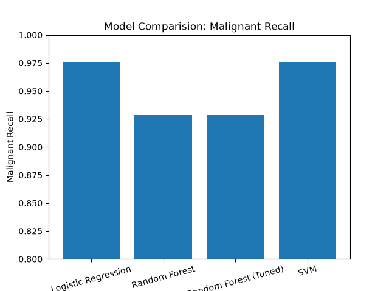

# breast-cancer-classifier

Binary classification on sklearn's breast cancer dataset: comparing
logistic regression, SVM, and Random Forest.

## Dataset
This dataset comes from sklearn's `load_breast_cancer` and represents 30
features extracted from digitized FNA (fine needle aspirate) images. The
class balance is 212 malignant and 357 benign.

## Approach
I started with a dummy baseline (63.2% accuracy, achieved by always
predicting the majority class) to establish the floor a real model needs
to beat. I then trained a logistic regression model, choosing it first due
to its simplicity and a higher probability of immediate success. After
scaling features with StandardScaler — needed because logistic regression's
optimizer has a hard time when features span vastly different numeric
ranges, and the unscaled model actually failed to fully converge within its
iteration limit — it reached 97.6% malignant recall.

Next I compared Random Forest and SVM to see whether a more complex model
family would perform better. I used GridSearchCV with 5-fold
cross-validation to tune Random Forest's hyperparameters, using a custom
scorer targeting malignant recall specifically rather than sklearn's
default. This mattered because sklearn's default recall metric measures
performance on label 1 (benign), but the more dangerous error in this
problem is a missed malignant case — a false negative means a real cancer
goes undetected, which is far worse than a false positive triggering an
unnecessary follow-up test. So I built a custom scorer that specifically
targets recall on the malignant class instead.

## Results

| Model                  | Malignant Recall | Accuracy |
|-------------------------|-------------------|----------|
| Dummy Baseline           | 0%                | 63.2%    |
| Logistic Regression      | 97.6%             | 98.2%    |
| Random Forest            | 92.9%             | 96.5%    |
| Random Forest (Tuned)    | 92.9%             | 96.5%    |
| SVM                      | 97.6%             | 98.2%    |

## Key Findings

- Logistic regression and SVM both outperformed Random Forest on malignant
  recall, likely due to the small dataset size and the features being
  close to linearly separable — allowing a linear boundary to cleanly
  split the classes with minimal data, whereas tree ensembles like Random
  Forest typically need larger amounts of data to approximate a smooth
  decision boundary without overfitting.

- GridSearchCV tuning barely changed Random Forest's malignant recall
  (92.9% before and after tuning), suggesting this was a model-data
  mismatch rather than a tuning problem.

- Logistic regression and SVM made the exact same single misclassification
  on the test set, verified directly by comparing which samples each model
  got wrong. Since two independently trained models with different
  underlying math converged on the same mistake, this suggests the issue
  likely lies in that specific sample's features looking uncharacteristic
  for its true class, rather than in either model's approach.

## Limitations

This is a learning project, not a deployable diagnostic tool. The 30 input
features aren't things like symptoms or an X-ray — they're measurements
computed from a digitized image of a fine needle aspirate (FNA), a medical
imaging pipeline that takes an actual biopsy sample, images the cell nuclei
under a microscope, and mathematically computes these 30 features from that
image. This means the model can't be pointed at new, arbitrary patient
data — someone would already need to have gone through this real
diagnostic pipeline to generate the 30 numbers the model expects.

Additionally, this dataset has only 569 samples, which is small by modern
ML standards — real clinical deployment would require far more validation,
larger and more diverse datasets, and regulatory approval.

## Setup
pip install -r requirements.txt